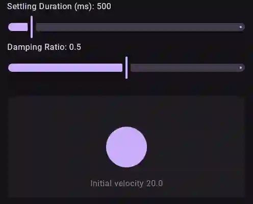

# What?
Cupertino flavored Compose Multiplatform spring constructors that are familiar to iOS developers.



# Why?
1. For funzies
2. Brain cell gain
3. Someone probably was looking for something like this for compose
4. i'm pretty sure no one else did this?

# Is it accurate?
Yes. Or at the very least the inaccuracies are imperceptible.

I also edited the overscroll effect implementation to feel more accurate. The usage of the springs looks like
```kotlin
spring() // the default duration based spring with 500ms duration and 0 bounce
// or like
smooth(extraBounce = 0.3f) // btw all return the compose SpringSpec<T>
// or like
spring(duration = 200.milliseconds, bounce = 0.3f)
// or like
PhysicsBasedSpring.spring(response = 0.2, dampingRatio = 0.6f)
```

# Note:
NOT (or perhaps yes) PRODUCTION READY CODE. FOR EDUCATIONAL PURPOSES ONLY
